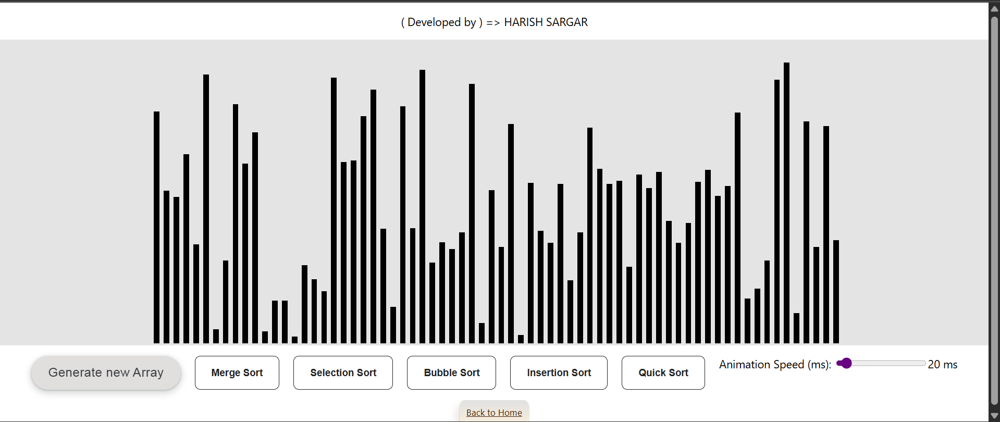
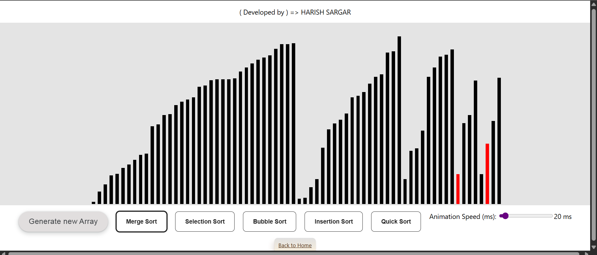

# Sorting Visualizer 🔢🎨

Welcome to the **Sorting Visualizer** – an interactive web tool that helps you understand and visualize how popular sorting algorithms work in real-time.

## 🚀 Live Demo
Check out the live app here: [Sorting Visualizer](https://algorithm-visualizer-ten-gamma.vercel.app/sorting)

---

## 🛠 Features

- 🎲 Generate a random array of bars
- ⏩ Adjustable animation speed (ms)
- 📊 Visualize the following sorting algorithms:
  - Merge Sort
  - Selection Sort
  - Bubble Sort
  - Insertion Sort
  - Quick Sort

---

## 📸 Screenshot

---
